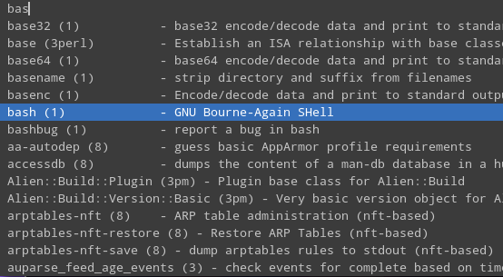
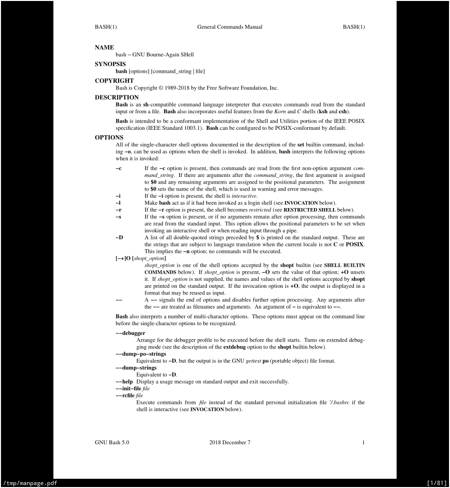

# shellscripts
Shell scripts that I have written

## randcopypasta.sh
Prints out a random copypasta from [r/copypasta](https://www.reddit.com/r/copypasta/new) on [Reddit](https://www.reddit.com).

Requires [pup](https://github.com/ericchiang/pup) for web scraping.

```
$ ./randcopypasta.sh

  What would you do if Biden wins and he comes out for his speech and says “trump? More like what a dump!” Followed by him and Harris dancing and laughing with Biden supporters dancing and laughing and Biden says “hello me and socialism, goodbye guns and Trump!” Followed by more dancing?

```

## owoifier.sh
Uses regex substitution to translate text into furry text.

```
$ cat sentence
The quick brown fox jumps over the lazy dog.
$ cat sentence | ./owoifier.sh
The quick bwown fox jumps ovew the wazy dog.
$ ./owoifier.sh sentence
The quick bwown fox jumps ovew the wazy dog.
```

## manpagepdf.sh

Asks user which manual page to view, and opens manual page in PDF format with the PDF viewer specified in an argument.

Requires [dmenu](https://tools.suckless.org/dmenu/) to prompt the user for which manual page to open.

```
$ ./manpagepdf.sh zathura
```




